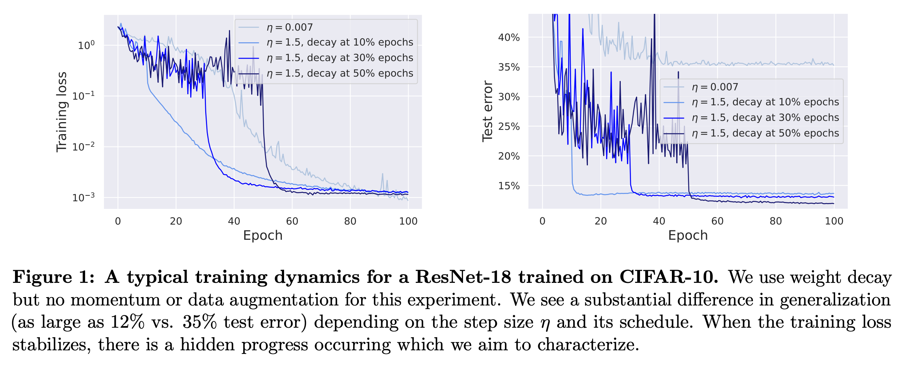
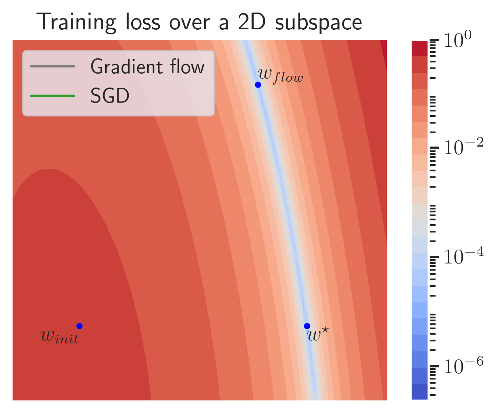

# SGD with large step sizes learns sparse features

**Maksym Andriushchenko, Aditya Varre, Loucas Pillaud-Vivien, Nicolas Flammarion (EPFL)**

**Paper:** [https://arxiv.org/abs/2210.05337](https://arxiv.org/abs/2210.05337)

## Abstract
We showcase important features of the dynamics of the Stochastic Gradient Descent (SGD) in the training of neural networks. We present empirical observations that commonly used large step sizes (i) lead the iterates to jump from one side of a valley to the other causing *loss stabilization*, and (ii) this stabilization induces a hidden stochastic dynamics orthogonal to the bouncing directions that *biases it implicitly* toward simple predictors. Furthermore, we show empirically that the longer large step sizes keep SGD high in the loss landscape valleys, the better the implicit regularization can operate and find sparse representations. Notably, no explicit regularization is used so that the regularization effect comes solely from the SGD training dynamics influenced by the step size schedule. Therefore, these observations unveil how, through the step size schedules, both gradient and noise drive together the SGD dynamics through the loss landscape of neural networks. We justify these findings theoretically through the study of simple neural network models as well as qualitative arguments inspired from stochastic processes. Finally, this analysis allows to shed a new light on some common practice and observed phenomena when training neural networks.

<!-- 
<video src="images/twitter.mp4" controls="controls" style="max-width: 500px;"></video>
 -->
<!-- 
<video width="400px" src="https://user-images.githubusercontent.com/14852704/195183184-dca5111c-2093-429e-816f-ce25b4c3e2a0.mp4" controls="controls" loop="true" autoplay="autoplay" controls muted></video>
 -->

## Code
The exact code to reproduce all the reported experiments on simple networks is available in jupyter notebooks:
- `diag_nets.ipynb`: diagonal linear networks (also see `diag_nets_2d_loss_surface.ipynb` for loss surface visualizations).
- `fc_nets_1d_regression.ipynb`: two-layer ReLU networks on 1D regression problem.
- `fc_nets_two_layer.ipynb`: two-layer ReLU networks in a teacher-student setup (+ neuron movement visualization).
- `fc_nets_multi_layer.ipynb`: three-layer ReLU networks in a teacher-student setup.

For deep networks, see folder `deep_nets` where the dependencies are collected in `Dockerfile`. Typical training commands for a ResNet-18 on CIFAR-10 would look like this:
- Plain SGD without explicit regularization (loss stabilization is achieved via exponential warmup): `python train.py --dataset=cifar10 --lr_max=0.75 --lr_schedule=piecewise_05epochs --warmup_exp=1.05 --model=resnet18_plain --model_width=64 --epochs=100 --batch_size=256 --momentum=0.0 --l2_reg=0.0 --no_data_augm --eval_iter_freq=200 --exp_name=no_explicit_reg`
- SGD + momentum in the state-of-the-art setting with data augmentation and weight decay: `python train.py --dataset=cifar10 --lr_max=0.05 --lr_schedule=piecewise_05epochs --model=resnet18_plain --model_width=64 --epochs=100 --batch_size=256 --momentum=0.9 --l2_reg=0.0005 --eval_iter_freq=200 --exp_name=sota_setting`

The step size schedule can be selected from [`constant`, `piecewise_01epochs`, `piecewise_03epochs`, `piecewise_05epochs`], see `utils_train.py` for more details.

## Contact
Feel free to reach out if you have any questions regarding the code!

